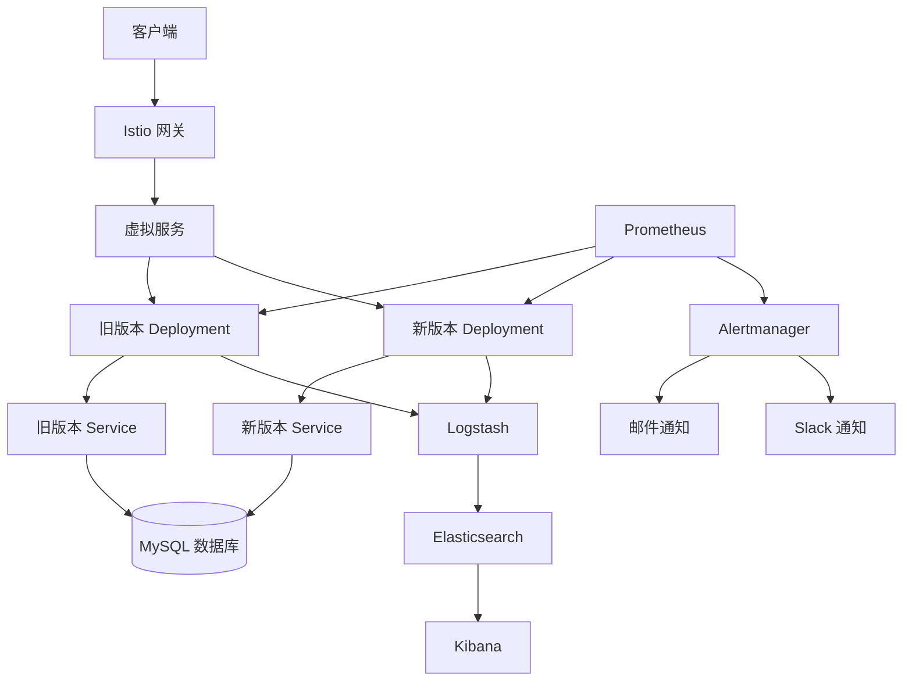

# 金丝雀发布实施方案

## 1. 项目概述

本项目是一个基于 Go 语言的 ERP 系统后端，使用 Gin 框架构建，主要功能模块包括：用户管理、销售管理、库存管理、采购管理、财务管理、生产管理、人力资源管理和客户关系管理。

### 技术栈

- **语言**：Go 1.23.0
- **Web 框架**：Gin 1.11.0
- **ORM**：GORM 1.25.7
- **数据库**：MySQL 8.0
- **认证**：JWT
- **配置管理**：Viper
- **依赖注入**：Wire
- **API 文档**：Swagger
- **容器化**：Docker
- **部署**：Docker Compose

## 2. 金丝雀发布方案

### 2.1 技术选型

- **容器编排**：Kubernetes
- **服务网格**：Istio
- **监控**：Prometheus + Grafana
- **日志**：ELK Stack (Elasticsearch + Logstash + Kibana)
- **告警**：Alertmanager

### 2.2 架构设计

#### 2.2.1 整体架构



#### 2.2.2 流量管理

- **使用 Istio VirtualService**：控制流量分配比例
- **使用 Istio DestinationRule**：定义服务版本和策略
- **使用 Istio Gateway**：管理入站流量

### 2.3 部署配置

#### 2.3.1 Kubernetes 部署配置

##### 旧版本部署 (v1)

```yaml
apiVersion: apps/v1
kind: Deployment
metadata:
  name: erp-system-v1
spec:
  replicas: 3
  selector:
    matchLabels:
      app: erp-system
      version: v1
  template:
    metadata:
      labels:
        app: erp-system
        version: v1
    spec:
      containers:
      - name: erp-system
        image: erp-system:v1
        ports:
        - containerPort: 8080
        env:
        - name: GIN_MODE
          value: "release"
        - name: ENV
          value: "production"
        volumeMounts:
        - name: config-volume
          mountPath: /root/configs
      volumes:
      - name: config-volume
        configMap:
          name: erp-system-config
```

##### 新版本部署 (v2)

```yaml
apiVersion: apps/v1
kind: Deployment
metadata:
  name: erp-system-v2
spec:
  replicas: 3
  selector:
    matchLabels:
      app: erp-system
      version: v2
  template:
    metadata:
      labels:
        app: erp-system
        version: v2
    spec:
      containers:
      - name: erp-system
        image: erp-system:v2
        ports:
        - containerPort: 8080
        env:
        - name: GIN_MODE
          value: "release"
        - name: ENV
          value: "production"
        volumeMounts:
        - name: config-volume
          mountPath: /root/configs
      volumes:
      - name: config-volume
        configMap:
          name: erp-system-config
```

##### 服务配置

```yaml
apiVersion: v1
kind: Service
metadata:
  name: erp-system
spec:
  selector:
    app: erp-system
  ports:
  - port: 80
    targetPort: 8080
  type: ClusterIP
```

#### 2.3.2 Istio 配置

##### 网关配置

```yaml
apiVersion: networking.istio.io/v1alpha3
kind: Gateway
metadata:
  name: erp-system-gateway
spec:
  selector:
    istio: ingressgateway
  servers:
  - port:
      number: 80
      name: http
      protocol: HTTP
    hosts:
    - "erp-system.example.com"
```

##### 虚拟服务配置 (初始状态 - 100% 流量到 v1)

```yaml
apiVersion: networking.istio.io/v1alpha3
kind: VirtualService
metadata:
  name: erp-system
spec:
  hosts:
  - "erp-system.example.com"
  gateways:
  - erp-system-gateway
  http:
  - route:
    - destination:
        host: erp-system
        subset: v1
      weight: 100
    - destination:
        host: erp-system
        subset: v2
      weight: 0
```

##### 目标规则配置

```yaml
apiVersion: networking.istio.io/v1alpha3
kind: DestinationRule
metadata:
  name: erp-system
spec:
  host: erp-system
  subsets:
  - name: v1
    labels:
      version: v1
  - name: v2
    labels:
      version: v2
```

### 2.4 监控与告警

#### 2.4.1 Prometheus 配置

```yaml
apiVersion: monitoring.coreos.com/v1
kind: ServiceMonitor
metadata:
  name: erp-system
spec:
  selector:
    matchLabels:
      app: erp-system
  endpoints:
  - port: metrics
    interval: 15s
```

#### 2.4.2 Grafana 仪表盘

创建一个专门的仪表盘，包含以下面板：

- **请求率**：按版本分组的请求率
- **错误率**：按版本分组的错误率
- **响应时间**：按版本分组的 P95/P99 响应时间
- **资源使用率**：按版本分组的 CPU/内存使用率
- **数据库查询时间**：按版本分组的数据库查询时间

#### 2.4.3 告警规则

```yaml
groups:
- name: erp-system-alerts
  rules:
  - alert: HighErrorRate
    expr: |
      sum(rate(http_requests_total{status=~"5..",app="erp-system"}[5m])) by (version) / 
      sum(rate(http_requests_total{app="erp-system"}[5m])) by (version) > 0.05
    for: 2m
    labels:
      severity: critical
    annotations:
      summary: "高错误率 (版本 {{ $labels.version }})"
      description: "错误率超过 5%，当前值: {{ $value | humanizePercentage }}"

  - alert: HighResponseTime
    expr: |
      histogram_quantile(0.95, sum(rate(http_request_duration_seconds_bucket{app="erp-system"}[5m])) by (version, le)) > 1
    for: 2m
    labels:
      severity: warning
    annotations:
      summary: "高响应时间 (版本 {{ $labels.version }})"
      description: "P95 响应时间超过 1 秒，当前值: {{ $value }}s"

  - alert: ServiceDown
    expr: |
      up{app="erp-system"} == 0
    for: 1m
    labels:
      severity: critical
    annotations:
      summary: "服务不可用 (版本 {{ $labels.version }})"
      description: "服务已停止运行超过 1 分钟"
```

### 2.5 数据策略

#### 2.5.1 数据库隔离

由于本项目使用 MySQL 数据库，我们采用以下策略确保数据安全：

1. **发布前备份**：在每次发布前备份生产数据库
2. **读写分离**：新版本和旧版本共享同一个数据库实例，但通过连接池隔离
3. **数据迁移**：如果涉及数据库结构变更，使用迁移脚本并确保可以回滚
4. **事务管理**：确保所有数据库操作都在事务中执行，保证数据一致性

#### 2.5.2 配置隔离

1. **环境变量**：通过环境变量区分不同环境
2. **配置映射**：使用 Kubernetes ConfigMap 管理配置
3. **版本控制**：配置文件纳入版本控制，确保可追溯性

### 2.6 回滚策略

#### 2.6.1 回滚触发条件

- **错误率超过阈值**：5xx 错误率超过 5%
- **响应时间异常**：P95 响应时间超过 1 秒
- **服务不可用**：Pod 持续崩溃或重启
- **数据异常**：数据库操作失败或数据不一致
- **用户投诉**：收到大量用户投诉

#### 2.6.2 回滚步骤

1. **流量切换**：更新 VirtualService，将所有流量切回旧版本
   ```yaml
   apiVersion: networking.istio.io/v1alpha3
   kind: VirtualService
   metadata:
     name: erp-system
   spec:
     hosts:
     - "erp-system.example.com"
     gateways:
     - erp-system-gateway
     http:
     - route:
       - destination:
           host: erp-system
           subset: v1
         weight: 100
       - destination:
           host: erp-system
           subset: v2
         weight: 0
   ```

2. **验证回滚**：
   - 确认所有流量已切回旧版本
   - 检查监控指标是否恢复正常
   - 验证用户功能是否正常

3. **分析问题**：
   - 查看日志和监控数据，定位问题根因
   - 编写问题报告，记录回滚原因和过程

4. **清理资源**：
   - 如需彻底回滚，删除新版本 Deployment
   - 保留新版本的配置和镜像，以便后续分析

## 3. 实施步骤

### 3.1 准备阶段

1. **环境搭建**：
   - 部署 Kubernetes 集群
   - 安装 Istio
   - 部署 Prometheus、Grafana 和 ELK Stack

2. **应用改造**：
   - 添加健康检查端点
   - 添加监控指标暴露
   - 确保日志格式标准化

3. **配置准备**：
   - 创建 Kubernetes 配置文件
   - 创建 Istio 配置文件
   - 配置监控和告警

4. **测试准备**：
   - 编写自动化测试脚本
   - 准备测试数据
   - 制定测试计划

### 3.2 发布阶段

#### 3.2.1 初始部署 (0% 流量)

1. **部署新版本**：
   ```bash
   kubectl apply -f k8s/deployment-v2.yaml
   ```

2. **验证新版本**：
   ```bash
   kubectl rollout status deployment/erp-system-v2
   ```

3. **检查健康状态**：
   ```bash
   kubectl get pods -l app=erp-system,version=v2
   ```

#### 3.2.2 小流量测试 (5% 流量)

1. **更新流量配置**：
   ```bash
   kubectl apply -f istio/virtual-service-5.yaml
   ```

2. **监控指标**：
   - 观察 Grafana 仪表盘中的各项指标
   - 检查是否有错误或异常

3. **持续时间**：15-30 分钟

#### 3.2.3 流量扩大 (20% 流量)

1. **更新流量配置**：
   ```bash
   kubectl apply -f istio/virtual-service-20.yaml
   ```

2. **深入验证**：
   - 检查所有功能模块
   - 分析用户行为和反馈
   - 验证数据库性能和一致性

3. **持续时间**：30-60 分钟

#### 3.2.4 进一步扩大 (50% 流量)

1. **更新流量配置**：
   ```bash
   kubectl apply -f istio/virtual-service-50.yaml
   ```

2. **全面验证**：
   - 模拟峰值流量测试
   - 检查边缘情况处理
   - 验证第三方服务集成

3. **持续时间**：1-2 小时

#### 3.2.5 全量切换 (100% 流量)

1. **更新流量配置**：
   ```bash
   kubectl apply -f istio/virtual-service-100.yaml
   ```

2. **最终验证**：
   - 监控 24 小时，确保系统稳定
   - 收集用户反馈
   - 评估发布效果

3. **清理旧版本**：
   ```bash
   kubectl delete deployment/erp-system-v1
   ```

## 4. 自动化实现

### 4.1 CI/CD 流程

使用 GitLab CI 或 GitHub Actions 实现自动化的金丝雀发布流程：

```yaml
# .gitlab-ci.yml
stages:
  - build
  - test
  - deploy
  - canary
  - promote
  - cleanup

build:
  stage: build
  script:
    - docker build -t erp-system:$CI_COMMIT_SHORT_SHA .
    - docker push erp-system:$CI_COMMIT_SHORT_SHA

test:
  stage: test
  script:
    - go test ./...

deploy:
  stage: deploy
  script:
    - kubectl apply -f k8s/deployment-v2.yaml
    - kubectl rollout status deployment/erp-system-v2

canary:
  stage: canary
  script:
    - kubectl apply -f istio/virtual-service-5.yaml
    - sleep 1800  # 等待 30 分钟
    - ./scripts/check_metrics.sh
  when: manual

promote:
  stage: promote
  script:
    - kubectl apply -f istio/virtual-service-20.yaml
    - sleep 3600  # 等待 1 小时
    - ./scripts/check_metrics.sh
    - kubectl apply -f istio/virtual-service-50.yaml
    - sleep 7200  # 等待 2 小时
    - ./scripts/check_metrics.sh
    - kubectl apply -f istio/virtual-service-100.yaml
  when: manual

cleanup:
  stage: cleanup
  script:
    - kubectl delete deployment/erp-system-v1
  when: manual
```

### 4.2 自动化脚本

#### 4.2.1 检查指标脚本

```bash
#!/bin/bash

# 检查错误率
ERROR_RATE=$(curl -s http://prometheus:9090/api/v1/query | jq -r '.data.result[0].value[1]')

if (( $(echo "$ERROR_RATE > 0.05" | bc -l) )); then
  echo "错误率过高: $ERROR_RATE"
  exit 1
fi

# 检查响应时间
RESPONSE_TIME=$(curl -s http://prometheus:9090/api/v1/query | jq -r '.data.result[0].value[1]')

if (( $(echo "$RESPONSE_TIME > 1" | bc -l) )); then
  echo "响应时间过长: $RESPONSE_TIME"
  exit 1
fi

echo "所有指标正常"
exit 0
```

#### 4.2.2 回滚脚本

```bash
#!/bin/bash

# 更新 VirtualService，将流量切回 v1
ekubectl apply -f istio/virtual-service-rollback.yaml

# 验证回滚结果
echo "等待 30 秒后检查服务状态..."
sleep 30

ERROR_RATE=$(curl -s http://prometheus:9090/api/v1/query | jq -r '.data.result[0].value[1]')

if (( $(echo "$ERROR_RATE > 0.05" | bc -l) )); then
  echo "回滚后错误率仍然过高: $ERROR_RATE"
  exit 1
fi

echo "回滚成功，服务状态正常"
exit 0
```

## 5. 最佳实践

### 5.1 实施建议

1. **从小规模开始**：首次实施时，选择一个低风险的功能或模块进行金丝雀发布
2. **逐步扩大**：每次扩大流量前，确保所有指标都在正常范围内
3. **设置合理的阈值**：根据系统的历史数据设置合理的告警阈值
4. **保持沟通**：在发布过程中，保持与团队和相关方的沟通
5. **文档化**：记录每次发布的过程和结果，形成知识库

### 5.2 常见问题及解决方案

| 问题 | 原因 | 解决方案 |
|------|------|----------|
| 流量分配不均 | Istio 配置问题 | 检查 VirtualService 配置，确保权重设置正确 |
| 监控盲区 | 监控配置不完整 | 增加监控埋点，覆盖所有关键路径 |
| 回滚时间长 | 手动操作耗时 | 实现自动化回滚脚本，减少人工干预 |
| 数据不一致 | 数据库操作未事务化 | 使用数据库事务确保操作原子性 |
| 资源不足 | Pod 配置不合理 | 合理设置资源请求和限制，配置 HPA |

### 5.3 注意事项

1. **数据库兼容性**：确保新版本与旧版本使用相同的数据库结构，或实现平滑的架构迁移
2. **状态管理**：确保系统状态在版本切换时能够正确传递
3. **第三方服务**：确保新版本与第三方服务的集成正常工作
4. **安全合规**：确保发布过程符合安全合规要求
5. **性能影响**：监控发布过程对系统性能的影响

## 6. 总结

金丝雀发布是一种有效的部署策略，可以在确保系统稳定性的同时，加快新功能的上线速度。通过本方案的实施，我们可以：

1. **降低风险**：即使新版本有问题，影响范围也仅限于小部分用户
2. **快速验证**：可以快速验证新版本的性能和稳定性
3. **快速回滚**：如果发现问题，能够快速将流量切回旧版本
4. **持续改进**：通过监控和分析，不断优化系统性能和用户体验

本方案基于 Kubernetes 和 Istio 实现，提供了一套完整的金丝雀发布流程，包括架构设计、技术实现、监控告警、数据策略和回滚机制。通过严格按照本方案实施，可以确保 ERP 系统的平稳升级和持续交付。

## 7. 参考资料

- [Kubernetes 官方文档](https://kubernetes.io/docs/)
- [Istio 官方文档](https://istio.io/docs/)
- [Prometheus 官方文档](https://prometheus.io/docs/)
- [Grafana 官方文档](https://grafana.com/docs/)
- [ELK Stack 官方文档](https://www.elastic.co/guide/index.html)
- [Canary Releases with Istio](https://istio.io/blog/2017/0.1-canary/)
- [Kubernetes Deployment Strategies](https://kubernetes.io/docs/concepts/workloads/controllers/deployment/#strategy)
