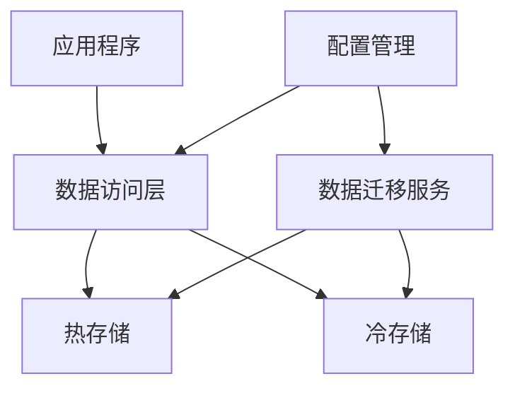

# 冷热分离设计文档

## 1. 概念介绍

冷热分离是一种数据管理策略，根据数据的访问频率和重要性，将数据分为"热数据"和"冷数据"，并采用不同的存储和处理策略：

- **热数据**：访问频率高、需要快速响应的数据，通常存储在高性能存储介质中（如内存、SSD）
- **冷数据**：访问频率低、对响应速度要求不高的数据，通常存储在大容量、低成本的存储介质中（如 HDD、文件系统）

## 2. 架构设计

### 2.1 整体架构

本项目的冷热分离架构由以下组件组成：

1. **数据存储接口**：定义统一的数据存储和访问方法
2. **热存储实现**：基于内存的高性能存储
3. **冷存储实现**：基于文件系统的持久化存储
4. **数据迁移服务**：定期检查数据访问情况，在热存储和冷存储之间迁移数据
5. **数据访问层**：提供统一的数据访问接口，透明处理数据的存储位置

### 2.2 组件关系



## 3. 实现细节

### 3.1 数据存储接口

定义了统一的数据存储和访问方法，包括：

- `Get`：获取数据
- `Save`：保存数据
- `Delete`：删除数据
- `List`：列出所有数据
- `FindColdData`：查找冷数据
- `FindHotData`：查找热数据

### 3.2 热存储实现

基于内存的高性能存储，特点：

- 快速的读写性能
- 自动跟踪数据访问时间和频率
- 适合存储频繁访问的数据

### 3.3 冷存储实现

基于文件系统的持久化存储，特点：

- 持久化存储，数据不会丢失
- 大容量、低成本
- 适合存储不常访问的数据

### 3.4 数据迁移服务

定期检查数据访问情况，执行以下操作：

- 将长期未访问的冷数据从热存储迁移到冷存储
- 将频繁访问的热数据从冷存储迁移到热存储
- 可配置的迁移阈值和检查间隔

### 3.5 数据访问层

提供统一的数据访问接口，特点：

- 透明处理数据的存储位置
- 优先从热存储获取数据
- 冷数据预热到热存储
- 统一的数据保存和删除操作

## 4. 配置管理

### 4.1 配置项

| 配置项 | 类型 | 默认值 | 说明 |
|--------|------|--------|------|
| `data.hotThreshold` | int64 | 3600 | 热数据阈值（秒），低于此值的数据视为热数据 |
| `data.coldThreshold` | int64 | 86400 | 冷数据阈值（秒），高于此值的数据视为冷数据 |
| `data.migrateInterval` | int64 | 300 | 迁移检查间隔（秒） |
| `data.coldStoragePath` | string | "./cold_data" | 冷存储路径 |

### 4.2 配置文件示例

```yaml
# 数据配置
data:
  hotThreshold: 3600  # 热数据阈值（秒）- 1小时
  coldThreshold: 86400  # 冷数据阈值（秒）- 24小时
  migrateInterval: 300  # 迁移检查间隔（秒）- 5分钟
  coldStoragePath: "./cold_data"  # 冷存储路径
```

## 5. 使用方法

### 5.1 初始化

冷热分离功能在应用启动时自动初始化：

```go
// 初始化冷热分离存储
log.Println("初始化冷热分离存储...")

// 创建热存储（内存存储）
hotStorage := storage.NewMemoryStorage()

// 创建冷存储（文件存储）
coldStoragePath := config.AppConfig.Data.ColdStoragePath
coldStorage, err := storage.NewFileStorage(coldStoragePath)
if err != nil {
	log.Fatalf("创建冷存储失败: %v", err)
}

// 创建数据迁移服务
migrator := migration.NewMigrator(
	hotStorage,
	coldStorage,
	config.AppConfig.Data.HotThreshold,
	config.AppConfig.Data.ColdThreshold,
	time.Duration(config.AppConfig.Data.MigrateInterval)*time.Second,
)

// 创建数据访问器
dataAccessor := data.NewAccessor(hotStorage, coldStorage)

// 启动数据迁移服务
migrateCtx, migrateCancel := context.WithCancel(context.Background())
migrator.Start(migrateCtx)
```

### 5.2 数据访问

使用数据访问器访问数据：

```go
// 保存数据
data := &storage.MemoryData{
	ID:          "data-1",
	CreatedAt:   time.Now().Unix(),
	AccessCount: 0,
	Data: map[string]interface{}{
		"key": "value",
	},
}
err := dataAccessor.Save(ctx, data)

// 获取数据
data, err := dataAccessor.Get(ctx, "data-1")

// 删除数据
err := dataAccessor.Delete(ctx, "data-1")

// 列出所有数据
dataList, err := dataAccessor.List(ctx)
```

### 5.3 关闭服务

在应用关闭时，停止数据迁移服务：

```go
// 停止数据迁移服务
log.Println("正在停止数据迁移服务...")
migrateCancel()
```

## 6. 性能优化

### 6.1 热数据缓存策略

- **优先从热存储获取数据**：减少冷存储的访问次数
- **冷数据预热**：当从冷存储获取数据时，自动将其预热到热存储
- **访问频率跟踪**：自动跟踪数据访问频率，为迁移决策提供依据

### 6.2 迁移策略优化

- **可配置的迁移阈值**：根据业务需求调整热数据和冷数据的判断标准
- **定期迁移检查**：避免频繁的迁移操作影响系统性能
- **异步迁移**：迁移操作在后台执行，不阻塞主线程

## 7. 监控和日志

### 7.1 日志记录

数据迁移服务会记录以下日志：

- 服务启动和停止
- 数据迁移操作
- 迁移失败的错误信息

### 7.2 监控指标

建议监控以下指标：

- 热存储和冷存储的数据量
- 数据迁移的频率和成功率
- 数据访问的响应时间
- 系统内存使用情况

## 8. 扩展和定制

### 8.1 存储实现扩展

可以根据业务需求，实现自定义的存储后端：

- **热存储**：可以使用 Redis、Memcached 等分布式缓存
- **冷存储**：可以使用 MySQL、PostgreSQL、MongoDB 等持久化数据库

### 8.2 迁移策略定制

可以根据业务需求，定制数据迁移策略：

- **基于访问频率的迁移**：根据数据访问次数决定迁移
- **基于数据大小的迁移**：大文件优先存储到冷存储
- **基于业务规则的迁移**：根据业务逻辑决定数据的存储位置

## 9. 最佳实践

### 9.1 配置建议

- **热数据阈值**：根据业务访问模式设置，一般为 1-24 小时
- **冷数据阈值**：根据数据重要性设置，一般为 1-7 天
- **迁移检查间隔**：根据系统负载设置，一般为 5-30 分钟

### 9.2 使用建议

- **小数据优先**：适合存储频繁访问的小数据
- **大数据谨慎**：大文件可能会占用过多内存，影响系统性能
- **定期清理**：定期清理不需要的数据，避免存储膨胀

## 10. 总结

本项目的冷热分离实现，通过合理的数据存储分层和自动迁移机制，实现了以下目标：

- **提高系统性能**：热数据存储在内存中，响应速度快
- **降低存储成本**：冷数据存储在文件系统中，成本低
- **优化资源利用**：根据数据访问情况自动调整存储位置
- **简化开发**：提供统一的数据访问接口，透明处理存储细节

这种架构设计适用于需要处理大量数据、且数据访问频率差异较大的场景，如用户会话管理、缓存系统、日志存储等。
